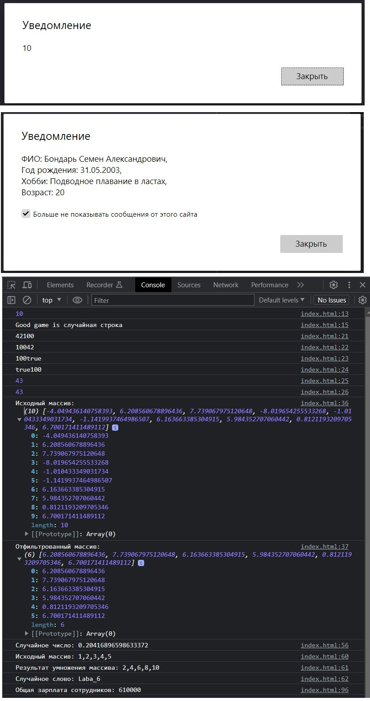

# Введение JavaScript

## Отчет по Лаб. №6
## ст. Бондарь С.А.
## гр. АСБ-3-036

------------

### Код задания:

```html
<!DOCTYPE html>
<html lang="ru">
<head>
    <meta charset="UTF-8"/>
    <meta name="viewport" content="width=device-width, initial-scale=1.0"/>
    <title>JS</title>
</head>
<body>
<script>
    // Задание 1. Работа с переменными
    var apple = 10;
    alert(apple);
    console.log(apple);
    var condition = 'случайная строка';
    console.log('Good game is ' + condition);

//Вопросы/Ответы:
//1.Через какой оператор Вы объявили переменую?
 //- Оператор var.
//2.Какие доступны операторы для объявления переменных? В чём их отличия?
 //- В JavaScript есть операторы var, let, и const, с разными областями видимости и свойствами.
//3.Что происходит при вызове alert()?
 //- alert(apple) выводит значение переменной apple в диалоговом окне.
//4.Как Вы думаете для чего может использоваться console.log()?
 //- console.log() используется для отладки и вывода информации в консоль разработчика.

    // Задание 2. Магия конкатенации
    var someInt = 42;
    var strValue = '100';
    var isTrue = true;
    console.log(someInt + strValue);
    console.log(strValue + someInt);
    console.log(strValue + isTrue);
    console.log(isTrue + strValue);
    console.log(someInt + isTrue);
    console.log(isTrue + someInt);

    // Задание 3. Работа с массивами
    var array = new Array(10);
    for (var i = 0; i < array.length; i++) {
        array[i] = Math.random() * 20 - 10;
    }
    var filteredArray = array.filter(function(number) {
        return number >= 0;
    });
    console.log("Исходный массив:", array);
    console.log("Отфильтрованный массив:", filteredArray);

    // Задание 4. Работа с функциями
    function getRandomNumber() {
        return Math.random();
    }

    function multiplyArrayByNumber(array, multiplier) {
        return array.map(function (element) {
            return element * multiplier;
        });
    }

    var generateRandomWord = function () {
        var words = ["Apple", "Samsung", "BMW", "Mersedes", "Laba_6", "ASB-3-036", "Audi", 	"Пожарская, Пюре, Белый соус", "Nokia 3310", "Stolovka RGUPS"];
        var randomIndex = Math.floor(Math.random() * words.length);
        return words[randomIndex];
    };

    console.log("Случайное число: " + getRandomNumber());

    var testArray = [1, 2, 3, 4, 5];
    var multiplier = 2;
    console.log("Исходный массив: " + testArray);
    console.log("Результат умножения массива: " + multiplyArrayByNumber(testArray, multiplier));
    console.log("Случайное слово: " + generateRandomWord());

    // Работа с объектами
    var person = {};
    person.surname = 'Бондарь';
    person.firstName = 'Семен';
    person.patronymic = 'Александрович';
    person.birthday = '31.05.2003';
    person.hobby = 'Подводное плавание в ластах';
    person.group = 'A';
 person.getInfo = function () {
        var age = new Date().getFullYear() - Number(person.birthday.split('.')[2]);
        return 'ФИО: ' + person.surname + ' ' + person.firstName + ' ' + person.patronymic +
            ', \nГод рождения: ' + person.birthday +
            ', \nХобби: ' + person.hobby + ', \nВозраст: ' + age;
    };
    alert(person.getInfo());

    var salaries = {
        'Иванов': 50000,
        'Петров': 60000,
        'Сидоров': 55000,
        'Козлов': 70000,
        'Смирнов': 75000,
        'Федоров': 52000,
        'Александров': 65000,
        'Дмитриев': 58000,
        'Михайлов': 72000,
        'Андреев': 53000
    };
    var totalSalary = 0;
    for (var lastName in salaries) {
        totalSalary += salaries[lastName];
    }
    console.log('Общая зарплата сотрудников: ' + totalSalary);
</script>
</body>
</html>
```
### Вывод задания:


